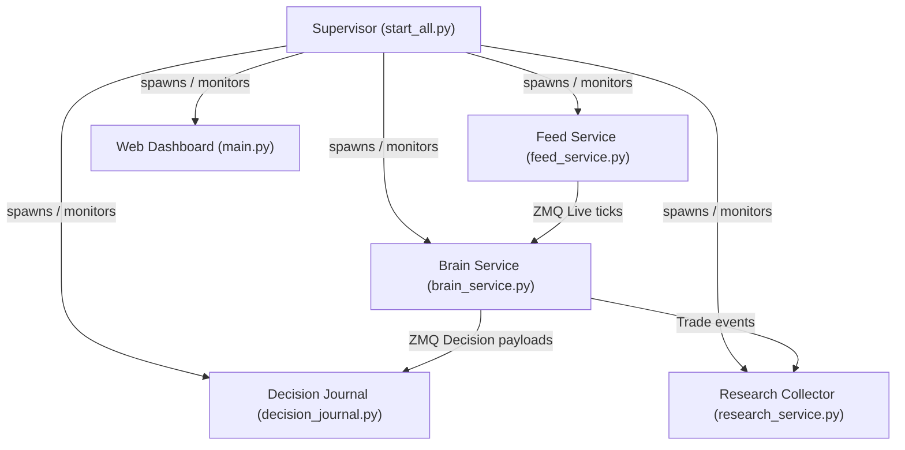

# Architecture — Options Quant Algo Platform

High-level system design, microservices division of labor, state orchestration, and decision trace design.

---

## 1. System Components & Orchestration

The platform runs as a coordinated group of independent microservices managed by `start_all.py` (Process Supervisor / Lifecycle Manager):

### Microservice Roles & States:
* **TRADING Session Services (`feed_service`, `brain_service`):** Active only during market hours (`TRADING_LIVE` state).
* **SYSTEM Services (`research_collector`, `decision_journal`, `web_dashboard`):** Active 24/7 across all states (`OFFLINE`, `TRADING_IDLE`, `TRADING_LIVE`).
* **SCHEDULER Services (`maintenance_service`, `gap_fill_service`):** Active during EOD maintenance or specific recovery windows.

---

## 2. Decision Intelligence & Explainability (Phase 2B)

Every opportunity, observation, and trade is cataloged into the Decision Journal to allow exact trading simulation and ML training without Python source analysis.

### The 3-Tier Trace Levels:
1. **Level 0 — Observation (`OBSERVED`):** Minimal flat ticks containing basic index high/low, VWAP indicators, and timestamp. Zero nested structures.
2. **Level 1 — Candidate (`CANDIDATE` / `FILTERED` / `SNIPER`):** Full strategy evaluation including rule arrays, parameter values, indicator thresholds, and Git code provenance hashes.
3. **Level 2 — Executed Trade (`EXECUTED` / `EXITED`):** Complete research contract payload stored inside `trade_history.json` and linked via a unique `decision_uuid`.

---

## 3. Database Schema Versioning

* **Universal Instrument Registry (`instruments.db`):** SQLite registry normalizer that maps active instruments across AngelOne and Shoonya brokers.
* **ML/Research Database (`ml_research.db`):** SQLite database holding feature datasets, indicators, and model weights.
* **Decision History Ledger (`decision_history.parquet`):** Flat, segment-partitioned Parquet journal.
