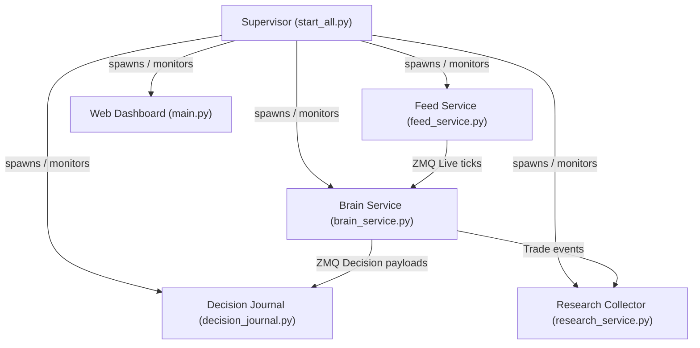

# Architecture — Options Quant Algo Platform

High-level system design, microservices division of labor, state orchestration, and decision trace design.

---

## 1. System Components & Orchestration

The platform runs as a coordinated group of independent microservices managed by `start_all.py` (Process Supervisor / Lifecycle Manager):



### Microservice Roles & States:
* **TRADING Session Services (`feed_service`, `brain_service`):** Active only during market hours (`TRADING_LIVE` state).
* **SYSTEM Services (`research_collector`, `decision_journal`, `web_dashboard`):** Active 24/7 across all states (`OFFLINE`, `TRADING_IDLE`, `TRADING_LIVE`).
* **SCHEDULER Services (`maintenance_service`, `gap_fill_service`):** Active during EOD maintenance or specific recovery windows.

---

## 2. Decision Intelligence & Explainability (Phase 2B)

Every opportunity, observation, and trade is cataloged into the Decision Journal to allow exact trading simulation and ML training without Python source analysis.

### The 3-Tier Trace Levels:
1. **Level 0 — Observation (`OBSERVED`):** Minimal flat ticks containing basic index high/low, VWAP indicators, and timestamp. Zero nested structures.
2. **Level 1 — Candidate (`CANDIDATE` / `FILTERED` / `SNIPER`):** Full strategy evaluation including rule arrays, parameter values, indicator thresholds, and Git code provenance hashes.
3. **Level 2 — Executed Trade (`EXECUTED` / `EXITED`):** Complete research contract payload stored inside `trade_history.json` and linked via a unique `decision_uuid`.

---

## 3. Database Schema Versioning

* **Universal Instrument Registry (`instruments.db`):** SQLite registry normalizer that maps active instruments across AngelOne and Shoonya brokers.
* **ML/Research Database (`ml_research.db`):** SQLite database holding feature datasets, indicators, and model weights.
* **Decision History Ledger (`decision_history.parquet`):** Flat, segment-partitioned Parquet journal.

---

## 4. Message Bus Resilience Pattern (Hotfix 1.0.1)

The ZeroMQ pub/sub message bus (`src/core/message_bus.py`) is the backbone for inter-process communication. Under memory pressure on the Oracle Cloud VPS (1 GB RAM), ZMQ sockets can enter an `ENOTSOCK` state, causing cascading crashes and the 35-restart loop observed pre-hotfix.

### Design Decisions
* **Shared Context:** Both `MessageBusPublisher` and `MessageBusSubscriber` use `zmq.Context.instance()` (process-wide singleton) instead of creating per-instance contexts. This prevents premature context termination when one socket closes.
* **Socket Recovery:** Each class implements `_init_socket()` → `_reconnect()` with a `_closed` flag. On `ENOTSOCK`, the socket is recreated and re-registered with the poller.
* **Topic Re-subscription:** `MessageBusSubscriber` tracks all subscribed topics in `self._topics`. On reconnect, all topics are re-subscribed automatically.
* **Graceful Close:** `close()` sets `socket.linger = 0` and closes the socket but does NOT terminate the shared context (`zmq.Context.instance()` is shared with other components).
* **IPC vs TCP:** Uses `ipc:///tmp/quant_{port}` on Linux (VPS) and `tcp://127.0.0.1:{port}` on Windows. Ports: CMD=5557, EXEC=5556, FEED=5555.

### DataFrame Duplicate Column Guard
Shoonya API responses can occasionally contain duplicate column names (especially `timestamp`). A defensive guard pattern is applied at all DataFrame ingestion points:
```python
df = df.loc[:, ~df.columns.duplicated()]
ts_col = df['timestamp']
if isinstance(ts_col, pd.DataFrame):
    ts_col = ts_col.iloc[:, 0]
```
Applied in: `shoonya_adapter.py` (`ShoonyaHistoricalProvider.get_historical`), `brain_service.py` (BootGapFill block).

---

## 5. Agent Onboarding Notes

Future agents working on this codebase should be aware of:
* **VPS Constraints:** Oracle Cloud VPS has 1 GB RAM / 2 CPU. Memory-efficient patterns are critical. Avoid spawning unnecessary processes or loading large DataFrames in memory simultaneously.
* **PM2 Process:** The engine runs as `quant-engine` under PM2 (fork mode). Check `pm2 logs quant-engine --lines 50 --nostream` for runtime diagnostics.
* **Paper Trading Only:** The system is in observation phase with paper trading (`CapitalEngine(mode="PAPER")`, `available_funds=2500.0`). Do NOT switch to live trading.
* **Architecture Freeze:** Phases 2A/2B/2C are complete and frozen. Only critical hotfixes are permitted during the observation period.
* **Hotfix History:** See `CHANGELOG.md` → `[1.0.1-hotfix]` and `docs/adr/0001-zmq-resilience-pattern.md` for the ZMQ resilience pattern rationale.
